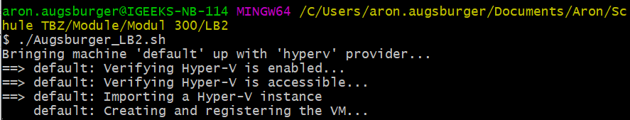
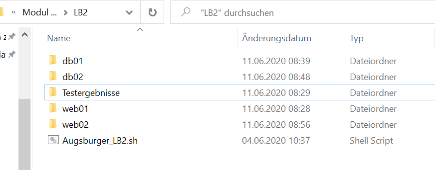
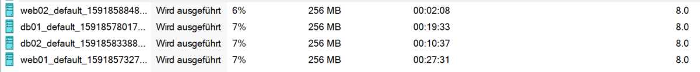
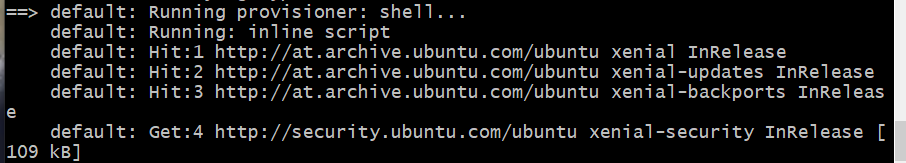
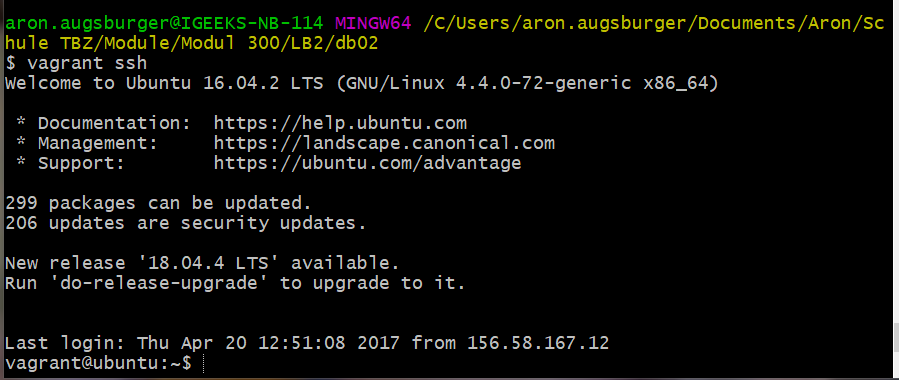
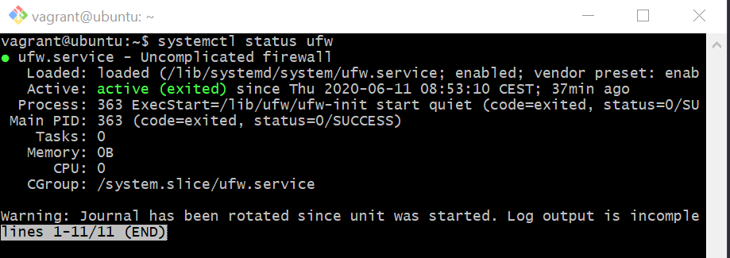
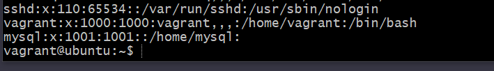

# Markdown LB2 Augsburger

## ST17e, Modul 300, M. Calisto

Ausführung Shell Script

* Git Bash öffnen
* In Repository Ordner wechseln
* ./Augsburger_LB2.sh ausführen

---

## Erklärung von Code
* Das Skript hat zwei "for" Schlaufen
  * Die erste "for" Schlaufe erstellt zwei Webserver und die zweite erstellt Datenbanken Server.


Installations Box von Vagrant Cloud:
```
config.vm.box = "kmm/ubuntu-xenial64"
```
Gibt Hyper-V als VM Provider an:
```
config.vm.provider "hyperv" do |h|

Bei Hyper-V müssen die commands mit h angegeben werden. Bei Virtualbox mit vb.
```
Dieser Ordner wird mit dem vagrant-VM Verzeichnis synchronisiert. Das selbe hat es für die DB-Server auch einfach /var/lib/mysql:
```
config.vm.synced_folder ".", "/var/www/html"
```
Die Shell in der VM -> Hier wird zum Beispiel Apache installiert:
```
config.vm.provision "shell", inline: <<-SHELL 
          sudo apt-get update
          sudo apt-get -y install apache2
        SHELL
```
Programmcode des HTML Files:
```
# index.html 
    cat <<%EOF% >index.html
    <html>
        <body>
            <h1>Startseite LB2 Aron Augsburger ${vm}</h1>
        </body>
    <html>
```
Installiert mysql Server und erstellt den Benutzer mysql:
```
sudo apt-get -y install mysql-server
          sudo useradd -m mysql
          echo mysql_passwort | passwd mysql --stdin
```
Hier wird die Firewall installiert und aktiviert. Ebenfalls der Port 80 zugelassen:
```
sudo apt-get -y install ufw
          sudo ufw enable
          sudo ufw allow 80/tcp
```
Hier wird die Firewall installiert und aktiviert. Ebenfalls der Port 3306 für alle zugelassen:
```
sudo apt-get -y install ufw
          sudo ufw enable
          sudo ufw allow from 0.0.0.0/0 to any port 3306
```

---

## Umgebung
* Das Shellscript erstellt zwei Webserver und zwei DB-Server.
* Die VMs laufen auf Hyper-V.

---

## Sicherheit
* Die Firewall hat die Ports 80 und 3306 geöffnet.
  * Port 80:
    * Wird für die Webserver benötigt.
  * Port 3306:
    * Wird für die DB-Server benötigt, und ist offen für alle.
    * Eigentlich ist das überhaupt nicht gut, dass es offen für alle ist, aber da unsere VMs die IP vom DHCP beziehen, ist uns unklar welches Netz wir freigeben müssen.
* Systeme und VM's die im Internet (DMZ) stehe sollten immer gehärtet sein.
* Dateinübertragungen sollten immer über eine Verschlüsselte Verbindung gemacht werden.
* Die Sicherheit kann im Script ausgebaut werden damit es den eigenen Standards entspricht.
* Mit SSH (Secure Shell) wird eine Verschlüsselte Verbindung zu einem entferneten Rechner oder System aufgebaut. Mit dieser verschlüsselten Verbindung kann auf die Commandline zugegriffen werden und Sicher auf anderen Systemen gearbeiet werden.

---

## Script anpassen
* Das Script kann ganz einfach mit dem Visual Studio Code geöffnet werden und dann angepasst werden.

---

## Testergebnisse
* Das Script startet erfolgreich, ohne Fehler.

https://ibb.co/gvYfWjD
* Es werden alle 4 VMs erstellt. Das heisst 2 Webserver und 2 DB-Server


https://ibb.co/n7ddbSj
https://ibb.co/zxxTty1
* Shell Befehle werden ausgeführt.

https://ibb.co/c65281M
* SSH Verbindung zu VM

https://ibb.co/QkdczkP
* Die Shell Befehle um die UFW zu installieren wird erledigt. Zusätzlich wird auch gleich noch Port 80 und 3306 geöffnet.

https://ibb.co/LzXLn7g
* Ebenfalls wird apache auf den Webserver installiert und mysql-server auf den DB-Server.

https://ibb.co/hymZ3RF
* Auf den DB-Server wird auch noch der Benutzer mysql erstellt.

https://ibb.co/XZgvtzg

---

## Fazit
* Ich finde das mir dieses Projekt ziemlich gut gelungen ist, da ich ein sauberes und vor allem auch funktionierendes Script schreiben konnte. Ich hatte am Anfang kleine Probleme mit meinem GitHub Account, da ich mein Repository nicht pushen konnte. Nachdem ich dies behoben habe, war alles in Ordnung. Dieses Thema fand ich sehr spannend, da es etwas komplett neues war und Spass gemacht hat. Ausserdem finde ich es auch gut, dass so schnell mehrere VMs erstellt werden können.
* In diesem Projekt hatte ich einen sehr hohen Wissenszuwachs. Da ich noch nie damit gearbeitet habe, war eigentlich alles neues Wissen, welches ich mir aneignen konnte. Ich kenne jetzt die Basis Befehle von Vagrant, sowie auch den ungefähren Aufbau von GitHub. Ich weiss jetzt wie man anhand von einem Script, mehrere VMs erstellen kann und diese auch gleich bearbeiten oder konfigurieren kann.

---
Author: Aron Augsburger